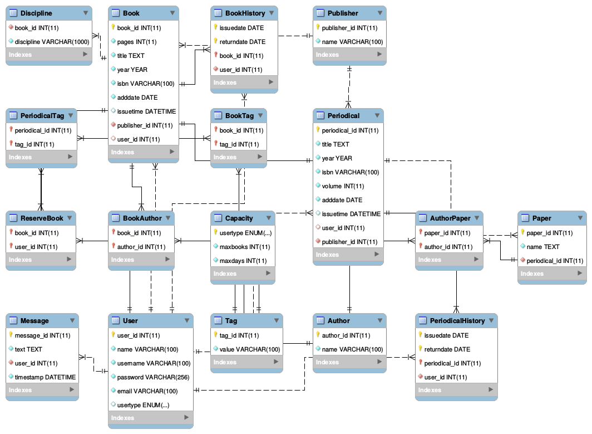
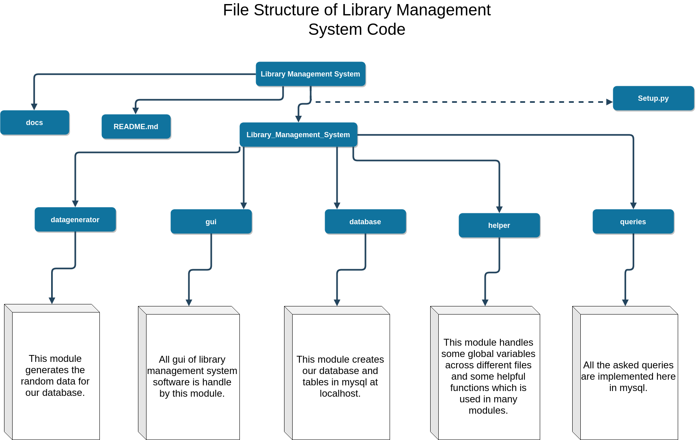

# Library Management System
A Library Management System for IIT Jammu in Mysql Database and Python.

### Database Model

## Requirements
- python3
- mysql-server, mysql-client
- pyqt5
- pandas
- mimesis
- pymysql

## How to Run Gui
- git clone https://github.com/vikasgola/Library-Management-System
- cd Library-Management-System
- python3 setup.py install
- LibMSsetup
- LibMS

## How to Run Queries
- cd Library_Management_System/queries/
- python3 queries.py
